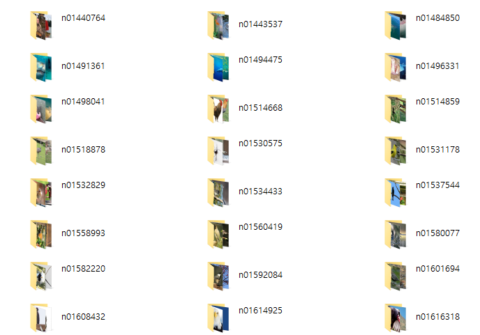
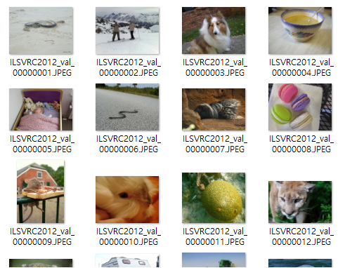
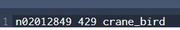
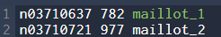
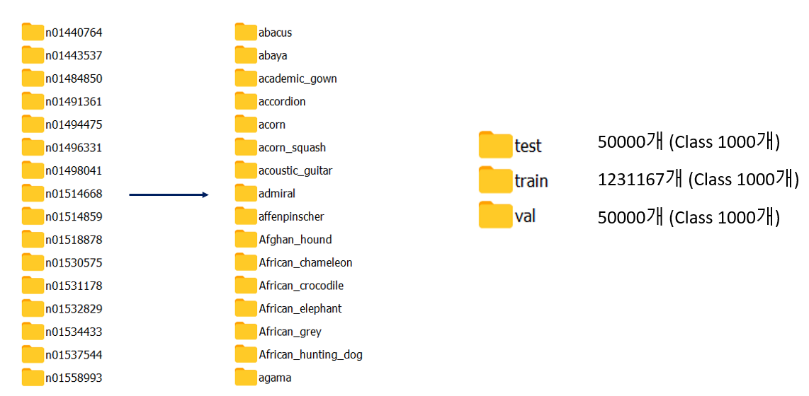

# ImageNet2012 Dataset Preprocessiong

# 1. ImageNet2012 Dataset Download

- official site : [http://image-net.org/download](http://image-net.org/download)
- torrent file download : [https://academictorrents.com/collection/imagenet-2012](https://academictorrents.com/collection/imagenet-2012)

공식 사이트 승인을 받을려면 3~5일 정도 기다려야 해서, 토렌트 파일로 다운로드 해야 한다.

원래 파일이 train/val/test 각각 있으나, test 파일은 라벨링이 되어 있지 않아 보통 val파일로 테스트를 적용했다.

1. validation 폴더는 이미지가 폴더별로 정리되어 있지 않아 train폴더 같이 정리가 필요하다.

    - train set 예시

        

    - val 예시

        

    - Imagenet_val_setup.sh 를 실행하면 Val 폴더 역시 train 폴더 같이 폴더별로 정리된다.

# 2. ImageNet2012 Preprocessing

- 학습 편의를 위해 왼쪽과 같이 된 폴더명을 클래스 명으로 각 변경한다.
- 폴더명 - 클래스 정수형 - 클래스명 map 파일

    map_clsloc.txt

- issue 1 : crane 중복
    - 변경

        

- issue 2: maillot 중복
    - 변경

        

- imagenet_data_prep.py
- 이미지넷 데이터는 폴더명이 n03857828 같이 분류되어 있다. 폴더명을 라벨명으로 변환 해줘야 한다.
- 또한 기존 이미지넷 test파일은 라벨링이 되어 있지 않아, train에서 일부 각 클래스당 50개씩 빼와서 test폴더를 만들어 준다.

- 실행 전→후

# 3. Convert to TFRecord

